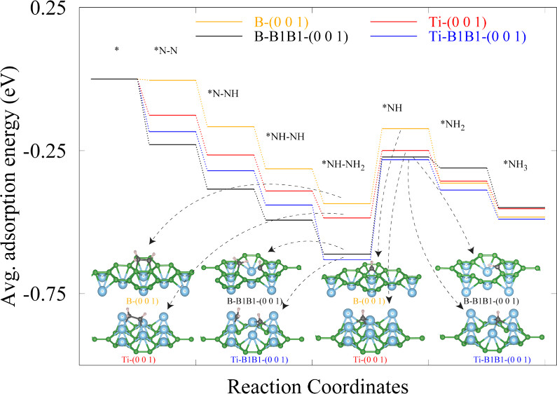

# About me
 I am a graduate student at NHR graduate school. Simultaneously hosted by Prof Andreas Görling, Lehrstuhl für Theoretische Chemie, FAU Erlangen. My hometown is Rajkot, in Gujarat, India.

# Research Interest
- **Fields of Interest** - Random Phase Approxiation based methods,  σ-Functionals, Kohn-Sham Formalism, Kohn-Sham Inversion, Electronic structure theory, and Computational Material Science.
- I am passionate about advancing methods to simulate electron correlation by leveraging to insightful Quantum chemistry formalism and High performace computing. 

# Research Experience
## **NHR Secondment (_July-2024 - Present_)** 

**PI: Prof. Thomas D. Kühne**
 _CASUS - Center for Advanced Systems Understanding am HZDR_

- **Ongoing research:** Collaborating with Dr. Frederick Stein, Prof. Thomas D. Kühne, Prof. Andreas Görling, and their teams to implement RPA-based σ-functionals in CP2K.

## **Doktorand (_May-2022 - Present_)**

**PI: Prof. Andreas Görling** _Lehrstuhl für Theoretische Chemie, FAU Erlangen_

- **Ongoing research:** Calculating accurate RPA based non-linear
optical properties.
- Under review in Nano letters [Bottom-up Synthesis and Characterization of Porous 12-Atom Wide Armchair Graphene Nanoribbons]()
- Investigation of ionization energies of small systems using Kohn-Sham inversion approach.
- Investigation of spatially symmetrized EXX methods to avoid spin contamination and Symmetry breaking

## **Junior Research Fellow (_Oct-2021 - Mar-2022_)**

**PI: Dr. Raghavan Ranganathan** _Materials Engineering, IIT Gandhinagar_ 

- Publication: [Vacancy Rich TiB2 Nanosheets Promote Electrochemical Ammonia Synthesis](https://pubs.acs.org/doi/full/10.1021/acsami.4c00253)

- Publication: [Nitrogen adsorption via charge transfer on vacancies created during surfactant assisted exfoliation of TiB 2](https://pubs.rsc.org/en/content/articlelanding/2023/nr/d2nr06676a/unauth)

## **Junior Research Fellow (_Jan-2021 to Oct-2021_)**

**PI: Dr. Vaishali Shah** _Department of Scientific computing, Modeling and, Simulation, Savitribai Phule Pune University_

- [Exploring the tunability of lead free Ba0. 5Sn0. 5TiO3 to mimic PbTiO3](https://www.sciencedirect.com/science/article/pii/S0254058423010799)

# Experience outside Research

## **NHR Speaker (_June-2024-Present_)**

- Representing the fellows of their cohort in interactions with the Steering Committee, Ph.D. supervisors, and the Executive Board of the NHR-Association.

- Organizing events that facilitate exchange between the fellows, as well as career and networking events.

- Assisting in the announcement of NHR Graduate School scholarships and other public relations activities.

- Furthermore, the activities include supporting the NHR Association in the quality assurance and further development of the NHR Graduate School.

## **Support Executive (_Sep-2020 - Dec-2020_).**

[Innovative Engineering Products Private Limited](https://ieppl.com/)

### Management representative.
* Implementation of the system & process designed by the consultant.
* Continuous co-ordination between Consultant, Management &, Employees.
* Participation in weekly & monthly review meetings with management, Staff & Consultant.

---
layout: default
title: Management Representative
---

## Management Representative

    <button class="dropbtn">Management Representative</button>
    

        
Implementation of the system & process designed by the consultant.

        
Continuous coordination between Consultant, Management, & Employees.

        
Participation in weekly & monthly review meetings with Management, Staff & Consultant.

    

### Data Analyst.
* Support existing Back office marketing team in generating reports.
* Manage & refine the existing Customer data
* Generate various MIS reports & graphics from Sales Data.

