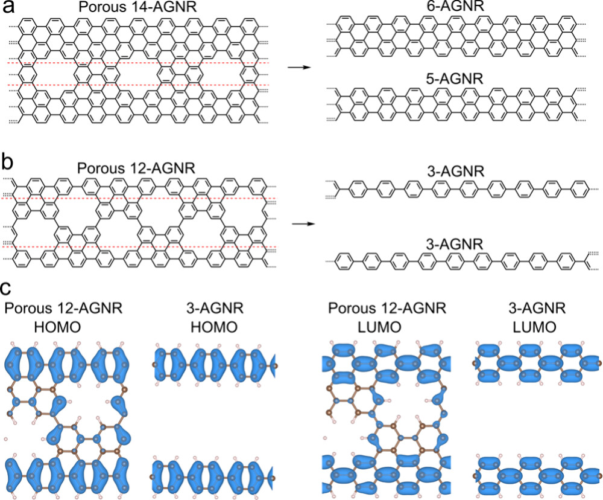
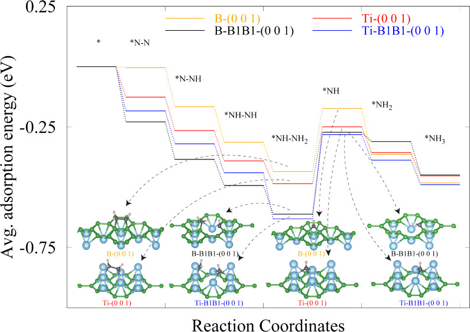

# Raviraj Mandalia

**PhD Candidate in Theoretical Chemistry** — FAU Erlangen-Nürnberg  
*Supervisor: Prof. Andreas Görling · Defense: Aug–Sep 2026*

[**Incoming Postdoctoral Researcher** — CASUS / HZDR (Oct 2026)]:#
[*Group: Prof. Thomas D. Kühne & Prof. Jan Wilhelm · BSE@GW and COHSEX analytic nuclear gradients*]:#

📧 **<raviraj.mandalia@fau.de>**  ·  💻 [GitHub](https://github.com/Raviraj26)  ·  🔗 [LinkedIn](https://www.linkedin.com/in/raviraj-mandalia-390684177)  ·  📚 [Google Scholar](https://scholar.google.com/citations?user=edNmQCYAAAAJ&hl=en)  ·  📄 [CV (PDF)](assests/CV_Raviraj_Mandalia.pdf)

---

## About
- I develop and implement electron-correlation methods for predictive electronic-structure calculations. My work sits at the intersection of method development, numerical optimization, and HPC implementation — taking adiabatic-connection-based correlation methods from formal derivation into peer-reviewed production-code implementations used by the computational chemistry and materials science communities.

- Recent first-author work in *The Journal of Chemical Physics* covers
  - An RPA / σ-functional implementation in **CP2K** with mixed Gaussian and plane-wave basis sets
  - The first systematic assessment of RPA and σ-functionals for static optical response properties.

- I am open to discussions on postdoctoral research for **late 2026 / early 2027** starts.

---

## Software

### PySCF — PyOEP based automation for molecular calculations
Using Python automation framework built on [PySCF](https://pyscf.org/) for OEP-based DFT calculations [PyOEP](https://github.com/EgorTrushin/PyOEP) of electron affinities, covering molecular and anionic systems on the G21EA benchmark and larger system sizes.

**Stack:** Python · PySCF · PyOEP
*Manuscript in preparation.*

### `oep-opt-package`
A modular CLI framework for **Optimization workflows**, built on top of Molpro.

- Workflow automation via Python numerical kernels
- Optimization of aux basis sets KS-inversion
- Electron-count conservation enforced to **machine precision** via frozen-orbital projection
- SLURM-integrated batch workflows with checkpointing

**Stack:** Python · Fortran · SLURM · Molpro  
**Repository:** [github.com/&lt;Raviraj26&gt;/oep-opt-package](https://github.com/Raviraj26/oep-opt-package)

### CP2K — RPA-based σ-functionals
Implement RPA-based σ-functionals into [CP2K](https://www.cp2k.org/) as part of an NHR secondment at CASUS, in collaboration with Dr. Frederick Stein, Prof. Thomas D. Kühne, and Prof. Andreas Görling.

**Published:** *J. Chem. Phys.* **163**, 224115 (2025) — [doi: 10.1063/5.0304890](https://doi.org/10.1063/5.0304890)  
Collaboration with Dr. Frederick Stein and Prof. Thomas D. Kühne (CASUS / HZDR) as part of an NHR secondment.

---

## Research Focus

- **Random Phase Approximation (RPA)** and **σ-functionals** within the Adiabatic Connection Fluctuation–Dissipation (ACFD) framework
- **Optimized Effective Potential (OEP)** and **Kohn–Sham inversion** for accurate exchange–correlation potentials and ionization energies
- Geometric OEP and inverse design of band quantum geometry
- Spatially symmetrized ACFD methods to mitigate spin contamination and symmetry breaking
- HPC-scale implementation of correlated electronic-structure methods in production codes

---

## Publications
### 2026
1. E. Trushin, **R. Mandalia**, A. Görling.
   "Accurate electron affinities from anion HOMO energies within the self-consistent random phase approximation"
   *(Under review w J. Chem. Phys.)*
   
### 2025
1. **R. Mandalia**, E. Trushin, F. Stein, T. D. Kühne, A. Görling.  
   "Mixed Gaussian and plane wave basis set implementation of the random phase approximation and of σ-functionals within the program package CP2K."  
   *J. Chem. Phys.* **163**, 224115 (2025) — [doi: 10.1063/5.0304890](https://doi.org/10.1063/5.0304890)

2. **R. Mandalia**, S. Fauser, E. Trushin, A. Görling.  
   "Assessment of RPA and σ-functional methods for the calculation of dipole moments and static polarizabilities and hyperpolarizabilities."  
   *J. Chem. Phys.* **162**, 184106 (2025) — [doi: 10.1063/5.0267912](https://doi.org/10.1063/5.0267912)

3. E. Trushin, **R. Mandalia**, A. Görling.  
   "Analyzing the response of exchange–correlation potentials of chain-like molecules to electric fields by Kohn–Sham inversion and evaluation of the response within the random phase approximation."  
   *J. Chem. Phys.* **163**, 244115 (2025) — [doi: 10.1063/5.0294687](https://doi.org/10.1063/5.0294687)

4. A. Rasyotra, A. Thakur, S. Shukla, **R. Mandalia**, R. Ranganathan, K. Jasuja.  
   "Surfactant-Assisted Exfoliation of Tantalum Diboride (TaB₂) for Electrochemical CO₂ Reduction."  
   *ACS Sustainable Chem. Eng.* **13**(6), 2312–2323 (2025) - [doi: 10.1021/acssuschemeng.4c06710](https://doi.org/10.1021/acssuschemeng.4c06710)

### 2024
1. Q. Fan, Z. Ruan, S. Werner, T. Naumann, R. Bolat, J. Martinez-Castro, … **R. Mandalia**, … et al.  
   "Bottom-up Synthesis and Characterization of Porous 12-Atom-Wide Armchair Graphene Nanoribbons."  
   *Nano Letters* **24**(35), 10718–10723 (2024) — [doi: 10.1021/acs.nanolett.4c01106](https://doi.org/10.1021/acs.nanolett.4c01106)

2. A. Rasyotra, A. Thakur, B. Gaykwad, **R. Mandalia**, R. Ranganathan, K. Jasuja.  
   "Vacancy-Rich TiB₂ Nanosheets Promote Electrochemical Ammonia Synthesis."  
   *ACS Applied Mater. Interfaces* **16**(19), 24473–24482 (2024) — [doi: 10.1021/acsami.4c00253](https://doi.org/10.1021/acsami.4c00253)

### 2023
1. A. Rasyotra, A. Thakur, **R. Mandalia**, R. Ranganathan, K. Jasuja.  
   "Nitrogen adsorption via charge transfer on vacancies created during surfactant-assisted exfoliation of TiB₂."  
   *Nanoscale* **15**(18), 8204–8216 (2023) — [doi: 10.1039/D2NR06676A](https://doi.org/10.1039/D2NR06676A)

2. B. Kshirsagar, **R. Mandalia**, V. Shah, B. Pujari, S. Premkumar.  
   "Exploring the tunability of lead-free Ba₀.₅Sn₀.₅TiO₃ to mimic PbTiO₃."  
   *Mater. Chem. Phys.* **309**, 128371 (2023). [doi: 10.1016/j.matchemphys.2023.128371](https://doi.org/10.1016/j.matchemphys.2023.128371)
---

## Experience

### Doctoral Researcher — FAU Erlangen-Nürnberg
*Lehrstuhl für Theoretische Chemie · May 2022 – Present*  
**PI: Prof. Andreas Görling**
- Development and benchmarking of RPA-based methods for non-linear optical properties
- Built `oep-opt-package` — modular optimization framework
- Investigation of spatially symmetrized ACFD methods
- Kohn–Sham inversion approach for accurate ionization energies of small systems

### NHR Secondment Researcher — CASUS / HZDR
*Center for Advanced Systems Understanding · Jul 2024 – Sep 2024*  
**PI: Prof. Thomas D. Kühne**
- Implementing RPA-based σ-functionals in CP2K
- Collaboration with Dr. Frederick Stein and the Görling group

### Junior Research Fellow — IIT Gandhinagar
*Materials Engineering · Oct 2021 – Mar 2022*  
**PI: Dr. Raghavan Ranganathan**
- DFT investigation of TiB₂ surface chemistry for electrochemical nitrogen fixation (2 publications)

### Junior Research Fellow — Savitribai Phule Pune University
*Department of Scientific Computing, Modeling and Simulation · Jan 2021 – Oct 2021*  
**PI: Dr. Vaishali Shah**
- Tunability study of lead-free perovskites Ba₀.₅Sn₀.₅TiO₃

### Management & Data Analyst (pre-PhD) — Innovative Engineering Products Pvt. Ltd.
*Sep 2020 – Dec 2020*
- Process implementation across consultant, management, and employee workflows
- MIS and sales-data reporting

---

## Skills

**Programming:** Python (advanced) · Fortran (advanced) · Julia · Bash · C++ *(in progress)*  
**Scientific computing:** [CP2K](https://www.cp2k.org/) (developer) · [Molpro](https://www.molpro.net/) (developer) · VASP · ASE · NumPy / SciPy  
**HPC:** SLURM · MPI / OpenMP · parallel scaling and performance analysis · [likwid](https://github.com/RRZE-HPC/likwid) profiling  
**Developer tools:** Git · VS Code · Jupyter · GNUplot · VESTA  
**Methods:** DFT · RPA · ACFD · σ-functionals · OEP / KS-inversion · electronic-structure theory  
**Quantum computing:** Qiskit (basics)  
**Languages:** English (fluent) · Hindi & Gujarati (native) 

---

## Awards & Fellowships

- **NHR Graduate Fellowship** — 2022
- **Best Project** — [NHR Summer School ML Hackathon](https://www.linkedin.com/feed/update/urn:li:activity:7208721400554020864/), 2024
- **GATE Physics** — Qualified, 2020
- **SRFP-2019 Fellowship** — Three Indian Academies of Sciences
- **Dr. M. S. Patel Prize** — Highest marks, 2nd year Bachelor's

---

## Service

**NHR Fellow Speaker** *(Jun 2024 – May 2025)*  
Elected representative of the NHR Graduate School fellow cohort. Liaison with the Steering Committee, PhD supervisors, and Executive Board of the NHR Association. Organize networking and career events; support fellowship recruitment and quality assurance.

---

## Current Interests

**Future directions**
- Analytic nuclear gradients for BSE@GW and COHSEX 
- Geometric formulations of the Optimized Effective Potential method

**Mathematical and computational interests**
- Berry curvature and topological aspects of electronic structure
- Lean theorem proving
- Inverse problems for Alcubierre-type spacetime metrics (general relativity)
- Fourier Neural Operators for PDEs and operator learning
  
---
## Selected Visual Work

  

    
    
<em>Porous 12-atom-wide armchair graphene nanoribbons</em> <a href="https://doi.org/10.1021/acs.nanolett.4c01106"><em>Nano Letters</em> (2024)</a>

  

  

    
    
<em>Vacancy-rich TiB₂ nanosheets</em> <a href="https://doi.org/10.1021/acsami.4c00253"><em>ACS Appl. Mater. Interfaces</em> (2024)</a>

  

  

    
    
<em>Charge density difference, N adsorption on TiB₂</em> <a href="https://doi.org/10.1039/D2NR06676A"><em>Nanoscale</em> (2023)</a>

  

*Last updated: May 2026*
